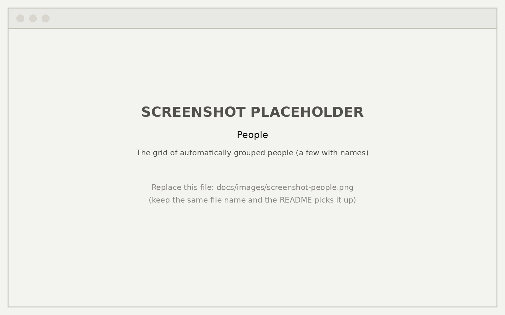
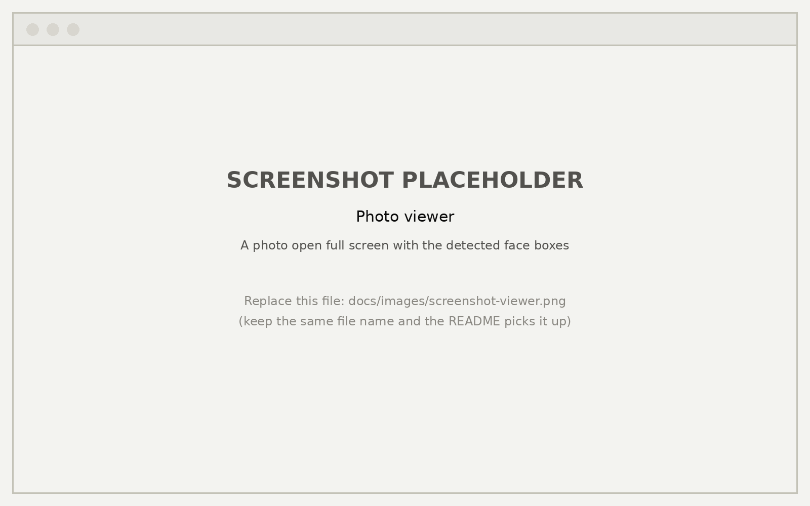
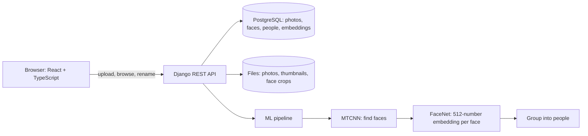
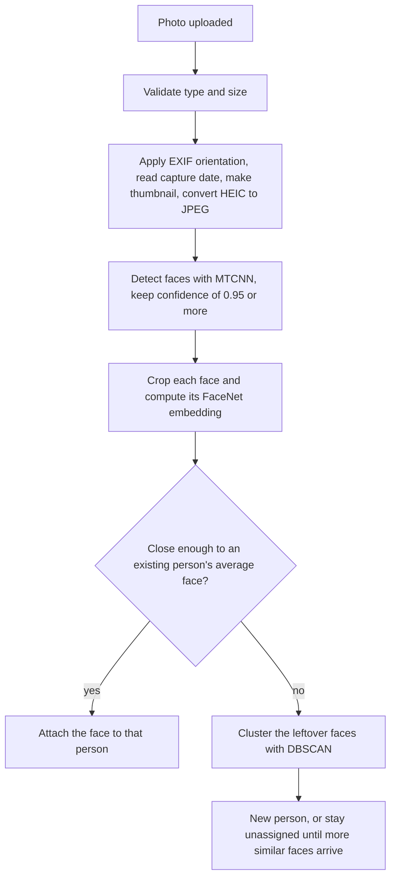
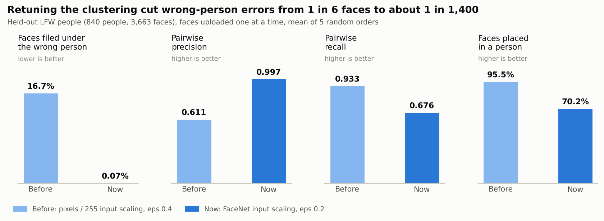
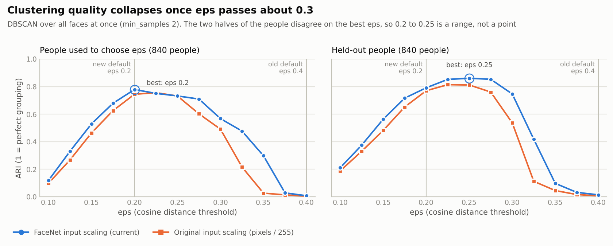
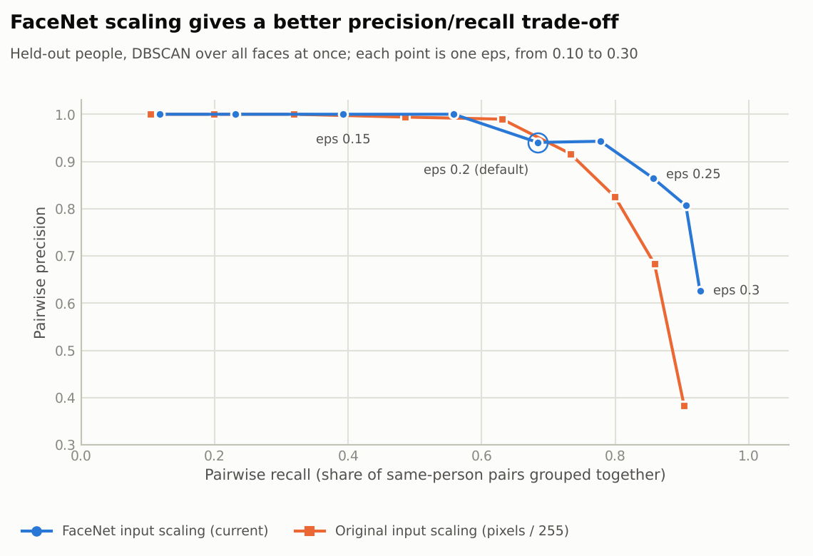
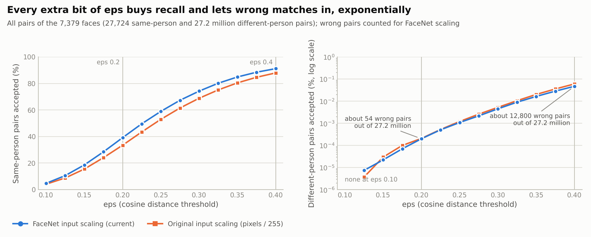

# FaceVault

**A self-hosted photo app that finds the faces in your photos and groups them into people, like the "People" view in Google Photos and Apple Photos.**

[](https://github.com/nmk27/Facevault/actions/workflows/ci.yml)


Upload photos, and FaceVault detects every face (MTCNN), turns each one into a 512-number fingerprint (FaceNet), and groups faces of the same person (DBSCAN clustering plus matching against people it already knows). Rename a person once and the name sticks, because later uploads are matched against existing people instead of regrouping everything.

The part that makes this more than a demo is the **evaluation**: the pipeline was measured on the public LFW face dataset, and the measurements changed the design. Wrong-person errors fell from **16.7% to 0.07%** of filed faces after the clustering threshold was tuned on held-out people (see [Results](#results)).

## Screenshots

| Gallery, grouped by the day photos were taken | People, grouped automatically |
|---|---|
|  |  |
| **A person's page** | **Photo viewer with detected faces** |
|  |  |


## Features

- **Upload** by drag and drop or file picker (JPEG, PNG, WebP, HEIC/HEIF up to 10 MB). iPhone HEIC photos are converted to JPEG, and EXIF orientation is applied, so portrait phone shots are handled correctly.
- **Face detection and grouping on upload**, with stable identities: a new face is first matched against the people you already have, so names survive later uploads.
- **Gallery grouped by the day a photo was taken** (EXIF date, falling back to upload time), with infinite scroll and a full-screen viewer (keyboard arrows, face boxes).
- **People view**: circular cards, rename a person inline, a timeline of all their photos.
- Light and dark mode.
- A benchmark suite that measures the whole pipeline on LFW, and a re-embedding command for when the model input changes.

## How it works



What happens to one uploaded photo:



The decision logic (matching and clustering) is a small database-free module, `backend/ml/clustering.py`. The app applies it to the database, and the evaluation applies it to benchmark data, so what is measured is what runs.

## Results

The pipeline was evaluated on **LFW** (original images; 7,381 photos of 1,680 people, at most 20 per person; a face was found in 7,379). The people are split into two disjoint halves: `eps`, the clustering threshold, is chosen on one half and every clustering number below is measured on the other (840 people, 3,663 faces). Faces are uploaded one at a time in random order, as in the app (mean of 5 orders).



| | Before (input `pixels / 255`, `eps` 0.4) | Now (FaceNet input scaling, `eps` 0.2) |
|---|---|---|
| Embedding AUC | 0.9979 | 0.9987 |
| Equal error rate | 1.63% | 1.14% |
| Same-person pairs found at 0.1% false matches | 90.6% | 94.3% |
| Pairwise precision | 0.611 | 0.997 |
| Faces filed under the wrong person | 16.7% | 0.07% |
| Faces placed in a person | 95.5% | 70.2% |
| Pairwise recall | 0.933 | 0.676 |
| ARI (agreement with the truth) | 0.737 | 0.805 |

### Conclusions

1. **The embeddings were never the problem; the clustering threshold was.** With `eps=0.4` the app filed about one face in six under the wrong person. Clustering all faces at once was worse still: ARI 0.007, with nearly everyone merged into a few huge groups.
2. **`eps` has a cliff.** Quality peaks around `eps` 0.2 to 0.25 and collapses between 0.3 and 0.35. A threshold turns two faces into "the same person", and DBSCAN chains such links, so a handful of wrong links is enough to merge whole groups.

   

3. **Precision first, and it costs recall.** `eps=0.2` keeps a safety margin before the cliff and suits a photo app, where a stranger in someone's folder is worse than a missing photo. The price is that about 30% of faces stay unassigned until more photos of that person arrive.
4. **The app's incremental design earns its keep.** Matching a new face to people who already exist stops one bad link from merging groups: at the old `eps=0.4` it lifts ARI from 0.014 (all at once) to 0.790, and at the new `eps=0.2` the two modes are about equal (0.792 and 0.805).
5. **FaceNet's own input scaling is better.** `(pixels - 127.5) / 128` beat the original `pixels / 255` on every verification measure and on the held-out clustering curve, so it is now the default.

   

6. **Why the threshold is so sensitive:** going from `eps` 0.2 to 0.4 raises the share of same-person pairs accepted about 2.3 times (39% to 91%), but raises the share of wrong pairs accepted about 240 times (54 wrong pairs becomes about 12,800).

   

### Limits of this evidence

- LFW is mostly frontal, well-lit celebrity photos, so family photo libraries will be harder. This is not LFW's standard 6,000-pair protocol, so the numbers are not comparable to published LFW accuracies.
- One split of the people. The two halves disagreed about the best `eps` for the new scaling (0.2 on one, 0.25 on the other), so treat `eps` as a range, not a precise optimum. The best `eps` should also fall as a library grows, because more faces mean more chances of a wrong match.
- The "Now" column used `eps` chosen on the tune half and measured on the held-out half. The choice of input scaling also drew on the sweep of both halves (and on the verification scores for all faces), so it is slightly less clean.
- On very small libraries the stricter `eps` leaves more faces unassigned than necessary (a quick 24-photo check left 9 of 24 faces without a person), because the chaining it guards against only appears as the library grows. A looser, separate threshold for matching new faces to people who already exist is the next thing to test.

The full write-up, with the method, the theory behind each step and a study guide, is in **[docs/PROJECT_REPORT.md](docs/PROJECT_REPORT.md)**. To reproduce the numbers, see [backend/evaluation/README.md](backend/evaluation/README.md). The raw results are in [`backend/evaluation/results_eps_fine/`](backend/evaluation/results_eps_fine/report.md).

## Tech stack

| Layer | Technology |
|---|---|
| Frontend | React 19, TypeScript, Vite, Tailwind CSS, TanStack Query, React Router |
| Backend | Django 5.2, Django REST Framework, PostgreSQL (SQLite works for development and tests) |
| ML | PyTorch, `facenet-pytorch` (MTCNN and FaceNet `InceptionResnetV1` pretrained on VGGFace2), scikit-learn (DBSCAN), Pillow, `pillow-heif` |
| Quality | 68 backend tests, GitHub Actions CI (backend tests; frontend typecheck, lint and build) |

## Getting started

**Prerequisites:** Python 3.11 or 3.12 (the pinned `torch==2.2.2` has no wheels for 3.13+, and pinned packages such as `networkx==3.6.1` need 3.11+), Node.js 20 or newer, and PostgreSQL (or SQLite, below).

### Backend

```bash
git clone https://github.com/nmk27/Facevault.git
cd Facevault/backend
python -m venv .venv
source .venv/bin/activate        # Windows: .venv\Scripts\activate
pip install -r requirements.txt
cp .env.example .env             # then adjust the database settings
python manage.py migrate
python manage.py runserver       # http://127.0.0.1:8000
```

No PostgreSQL? Set `DB_ENGINE=django.db.backends.sqlite3` and `DB_NAME=db.sqlite3` in `backend/.env`. The first upload downloads the pretrained FaceNet weights (about 100 MB) and is slower.

### Frontend

```bash
cd frontend
cp .env.example .env             # optional
npm install
npm run dev                      # http://localhost:5173
```

`VITE_ENABLE_MOCKS=true` runs the UI on generated sample data without a backend.

### Tests

```bash
# backend (no PostgreSQL needed); on Windows PowerShell set $env:DB_ENGINE and $env:DB_NAME first
cd backend
DB_ENGINE=django.db.backends.sqlite3 DB_NAME=db.sqlite3 python manage.py test

# frontend
cd frontend
npm run typecheck && npm run lint && npm run build
```

### Configuration

Backend settings come from environment variables (see `backend/.env.example`); defaults suit local development.

| Variable | Default | Meaning |
|---|---|---|
| `DJANGO_SECRET_KEY`, `DJANGO_DEBUG`, `DJANGO_ALLOWED_HOSTS` | development values | Standard Django settings. Set real values before deploying anywhere |
| `DB_ENGINE`, `DB_NAME`, `DB_USER`, `DB_PASSWORD`, `DB_HOST`, `DB_PORT` | PostgreSQL on localhost | Database connection |
| `CORS_ALLOWED_ORIGINS`, `CORS_ALLOW_ALL_ORIGINS` | the Vite dev server | Which web origins may call the API |
| `FACE_CLUSTER_EPS` | `0.2` | Distance threshold for "same person" (chosen on LFW, see Results) |
| `FACE_CLUSTER_MIN_SAMPLES` | `2` | Smallest group that becomes a person |

Commands: `python manage.py reembed_faces` recomputes stored embeddings from the saved face crops (people and names are kept; needed after changing the embedding input scaling), and `python manage.py dev_reset` wipes all photos and faces in a development database.

## API

| Endpoint | Purpose |
|---|---|
| `POST /photos/upload/` | Upload one photo (multipart field `image`); detects, embeds and groups its faces |
| `GET /photos/` | Paginated photos (24 per page), newest capture date first |
| `GET /photos/<id>/` | One photo |
| `GET /faces/<photo_id>/` | Faces detected in one photo |
| `GET /faces/people/` | All people with face counts |
| `GET /faces/people/<id>/` | One person and their faces |
| `PATCH /faces/people/<id>/` | Rename a person (`{"name": "..."}`) |

Details of the data model and the ML pipeline are in [backend/README.md](backend/README.md) and the [report](docs/PROJECT_REPORT.md).

## Project structure

```text
Facevault/
├── backend/
│   ├── facevault/      Django settings and URLs
│   ├── photos/         Photo model, upload and list API
│   ├── faces/          Face and Person models, people API, reembed_faces command
│   ├── ml/             Detection, embeddings, clustering (clustering.py has no database code)
│   ├── evaluation/     LFW benchmark: metrics, simulation, CLI, committed results
│   └── users/          development management command (dev_reset)
├── frontend/           React app (pages, components, hooks, API client)
├── docs/               Project report, figures, screenshots, figure script
└── .github/workflows/  CI
```

## Limitations and next steps

- **No authentication.** Anyone who can reach the server can see every photo and face. Do not expose it publicly as it is; face embeddings are biometric data.
- **Uploads are processed synchronously**: roughly 1 to 3 seconds per photo on a 4-core CPU (measured: 1.2 s for a 1 MP image, 3.2 s for 12 MP). A job queue would fix that.
- **People cannot be merged or split, and photos cannot be deleted** from the UI. An early wrong grouping is never revisited.
- **Recall is modest at the chosen threshold** (about 70% of faces placed). The next experiment is a looser, separate threshold for matching new faces to existing people.
- Embeddings are stored as JSON and compared in Python; at larger scale a vector index (for example `pgvector`) would replace that.
- The frontend has no automated tests yet.

## Acknowledgements and references

- **LFW**: Huang, Ramesh, Berg, Learned-Miller, *Labeled Faces in the Wild*, 2007 (University of Massachusetts Amherst).
- **FaceNet**: Schroff, Kalenichenko, Philbin, *FaceNet: A Unified Embedding for Face Recognition and Clustering*, CVPR 2015. Pretrained weights on **VGGFace2** (Cao et al., 2018) via the `facenet-pytorch` package.
- **MTCNN**: Zhang et al., *Joint Face Detection and Alignment using Multi-task Cascaded Convolutional Networks*, 2016.
- **DBSCAN**: Ester, Kriegel, Sander, Xu, *A Density-Based Algorithm for Discovering Clusters*, KDD 1996.

## License

[MIT](LICENSE)
