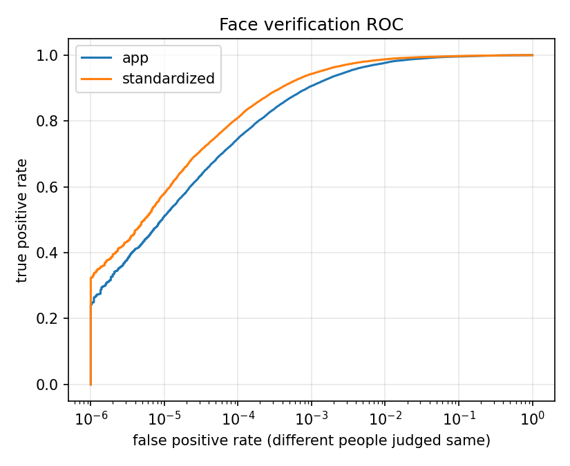
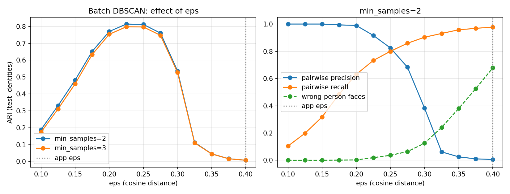
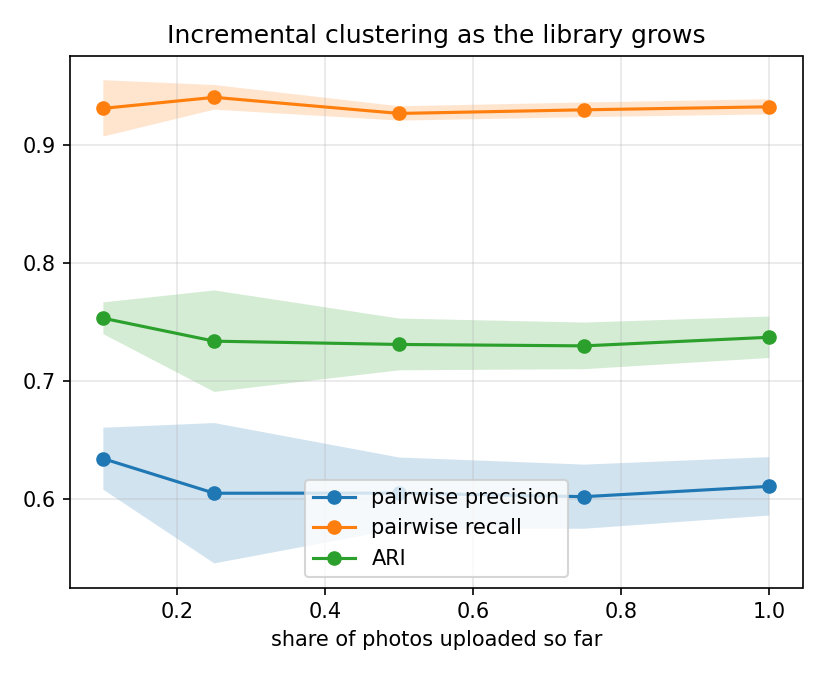

# FaceVault evaluation

## Protocol

- Dataset: <LFW folder, original images>; 7381 images of 1680 people (people with at least 2 images; at most 20 per person; seed 0).
- Detection: MTCNN with the app's gate (confidence >= 0.95) found a face in 7379 images (100.0%); 2 images dropped. People with only one detected face: 2.
- Embedding: the app's FaceNet pipeline on the app's face crop (tight box, no margin).
- Split: 50% of people choose eps/min_samples (best ARI); results are reported on the disjoint remaining people.
- Incremental: faces arrive 1 at a time in 5 random orders; after each batch the app's clustering logic runs over every face that has no person yet.
- App config: eps=0.4, min_samples=2.

## Results: app embeddings (as shipped)

### Verification (all faces, threshold-free)

AUC 0.9979 | EER 1.63% | TPR at FPR=0.1% 90.63% | 27,724 same-person and 27,193,407 different-person pairs

Same-person rule "cosine distance <= eps" (this is what eps means in the app):

| eps | same pairs accepted | different pairs accepted |
|---|---|---|
| 0.10 | 4.1% | 0.000% |
| 0.12 | 8.8% | 0.000% |
| 0.15 | 15.5% | 0.000% |
| 0.17 | 24.1% | 0.000% |
| 0.20 | 33.4% | 0.000% |
| 0.23 | 43.4% | 0.001% |
| 0.25 | 53.0% | 0.001% |
| 0.28 | 61.5% | 0.003% |
| 0.30 | 68.8% | 0.005% |
| 0.33 | 75.1% | 0.010% |
| 0.35 | 80.4% | 0.020% |
| 0.38 | 84.6% | 0.035% |
| 0.40 | 87.9% | 0.060% |

### Clustering on the test identities

Configs: {"app config": {"eps": 0.4, "min_samples": 2}, "tuned (best ARI on tune)": {"eps": 0.225, "min_samples": 2}, "conservative (max recall, precision >= .99 on tune)": {"eps": 0.15, "min_samples": 2}}

| configuration | ARI | pair P | pair R | pair F1 | in a person | wrong person* | people | identities |
|---|---|---|---|---|---|---|---|---|
| app config (eps=0.4, min_samples=2) - batch | 0.007 | 0.006 | 0.978 | 0.011 | 97.0% | 67.82% | 292 | 840 |
| app config (eps=0.4, min_samples=2) - incremental (mean of 5 orders) | 0.737 | 0.611 | 0.933 | 0.738 | 95.5% | 16.73% | 607 | 840 |
|     std over orders | 0.018 | 0.025 | 0.006 | 0.018 | 0.1% | 0.61% | 4 | 0 |
| tuned (best ARI on tune) (eps=0.225, min_samples=2) - batch | 0.814 | 0.917 | 0.733 | 0.814 | 73.8% | 1.92% | 633 | 840 |
| tuned (best ARI on tune) (eps=0.225, min_samples=2) - incremental (mean of 5 orders) | 0.826 | 0.996 | 0.706 | 0.826 | 74.7% | 0.12% | 647 | 840 |
|     std over orders | 0.004 | 0.000 | 0.006 | 0.004 | 0.1% | 0.01% | 3 | 0 |
| conservative (max recall, precision >= .99 on tune) (eps=0.15, min_samples=2) - batch | 0.482 | 1.000 | 0.318 | 0.483 | 41.4% | 0.00% | 426 | 840 |
| conservative (max recall, precision >= .99 on tune) (eps=0.15, min_samples=2) - incremental (mean of 5 orders) | 0.514 | 1.000 | 0.346 | 0.514 | 43.4% | 0.00% | 417 | 840 |
|     std over orders | 0.003 | 0.000 | 0.002 | 0.003 | 0.1% | 0.00% | 2 | 0 |

\* wrong person = of the faces filed under a person, the share filed under the wrong one (unassigned faces are not counted here but cost recall).

### Incremental clustering as the library grows (app config)

| share uploaded | faces | pair P | pair R | ARI | in a person |
|---|---|---|---|---|---|
| 10% | 367 | 0.634 | 0.931 | 0.753 | 47.2% |
| 25% | 916 | 0.605 | 0.941 | 0.734 | 69.7% |
| 50% | 1832 | 0.605 | 0.927 | 0.731 | 84.4% |
| 75% | 2748 | 0.602 | 0.930 | 0.730 | 91.4% |
| 100% | 3663 | 0.611 | 0.933 | 0.737 | 95.5% |

## Results: standardized embeddings (ablation)

### Verification (all faces, threshold-free)

AUC 0.9987 | EER 1.14% | TPR at FPR=0.1% 94.30% | 27,724 same-person and 27,193,407 different-person pairs

Same-person rule "cosine distance <= eps" (this is what eps means in the app):

| eps | same pairs accepted | different pairs accepted |
|---|---|---|
| 0.10 | 4.7% | 0.000% |
| 0.12 | 10.5% | 0.000% |
| 0.15 | 18.6% | 0.000% |
| 0.17 | 28.5% | 0.000% |
| 0.20 | 39.1% | 0.000% |
| 0.23 | 49.6% | 0.001% |
| 0.25 | 59.0% | 0.001% |
| 0.28 | 67.3% | 0.002% |
| 0.30 | 74.2% | 0.004% |
| 0.33 | 80.2% | 0.009% |
| 0.35 | 84.9% | 0.016% |
| 0.38 | 88.5% | 0.028% |
| 0.40 | 91.1% | 0.047% |

### Clustering on the test identities

Configs: {"app config": {"eps": 0.4, "min_samples": 2}, "tuned (best ARI on tune)": {"eps": 0.2, "min_samples": 2}, "conservative (max recall, precision >= .99 on tune)": {"eps": 0.15, "min_samples": 2}}

| configuration | ARI | pair P | pair R | pair F1 | in a person | wrong person* | people | identities |
|---|---|---|---|---|---|---|---|---|
| app config (eps=0.4, min_samples=2) - batch | 0.014 | 0.009 | 0.983 | 0.018 | 97.7% | 58.01% | 379 | 840 |
| app config (eps=0.4, min_samples=2) - incremental (mean of 5 orders) | 0.790 | 0.671 | 0.961 | 0.791 | 96.4% | 13.12% | 651 | 840 |
|     std over orders | 0.006 | 0.007 | 0.005 | 0.006 | 0.1% | 0.32% | 4 | 0 |
| tuned (best ARI on tune) (eps=0.2, min_samples=2) - batch | 0.792 | 0.940 | 0.684 | 0.792 | 69.0% | 1.30% | 595 | 840 |
| tuned (best ARI on tune) (eps=0.2, min_samples=2) - incremental (mean of 5 orders) | 0.805 | 0.997 | 0.676 | 0.806 | 70.2% | 0.07% | 603 | 840 |
|     std over orders | 0.004 | 0.000 | 0.005 | 0.004 | 0.1% | 0.02% | 2 | 0 |
| conservative (max recall, precision >= .99 on tune) (eps=0.15, min_samples=2) - batch | 0.563 | 1.000 | 0.393 | 0.564 | 45.3% | 0.00% | 424 | 840 |
| conservative (max recall, precision >= .99 on tune) (eps=0.15, min_samples=2) - incremental (mean of 5 orders) | 0.582 | 1.000 | 0.411 | 0.582 | 47.4% | 0.00% | 426 | 840 |
|     std over orders | 0.006 | 0.000 | 0.006 | 0.006 | 0.1% | 0.00% | 2 | 0 |

\* wrong person = of the faces filed under a person, the share filed under the wrong one (unassigned faces are not counted here but cost recall).

### Incremental clustering as the library grows (app config)

| share uploaded | faces | pair P | pair R | ARI | in a person |
|---|---|---|---|---|---|
| 10% | 367 | 0.704 | 0.950 | 0.808 | 46.0% |
| 25% | 916 | 0.675 | 0.967 | 0.794 | 68.8% |
| 50% | 1832 | 0.666 | 0.957 | 0.785 | 84.5% |
| 75% | 2748 | 0.661 | 0.959 | 0.782 | 91.9% |
| 100% | 3663 | 0.671 | 0.961 | 0.790 | 96.4% |

## Figures

## Caveats

- LFW is mostly frontal, well-lit celebrity photos, so scores are optimistic for family photo libraries.
- Identities were capped per person; pairwise scores are dominated by people with many images.
- Scores use the face closest to the image centre (the labelled person); the app stores every face it finds.
