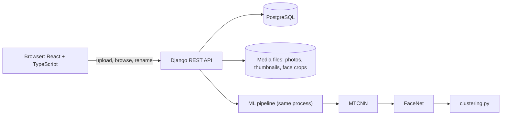
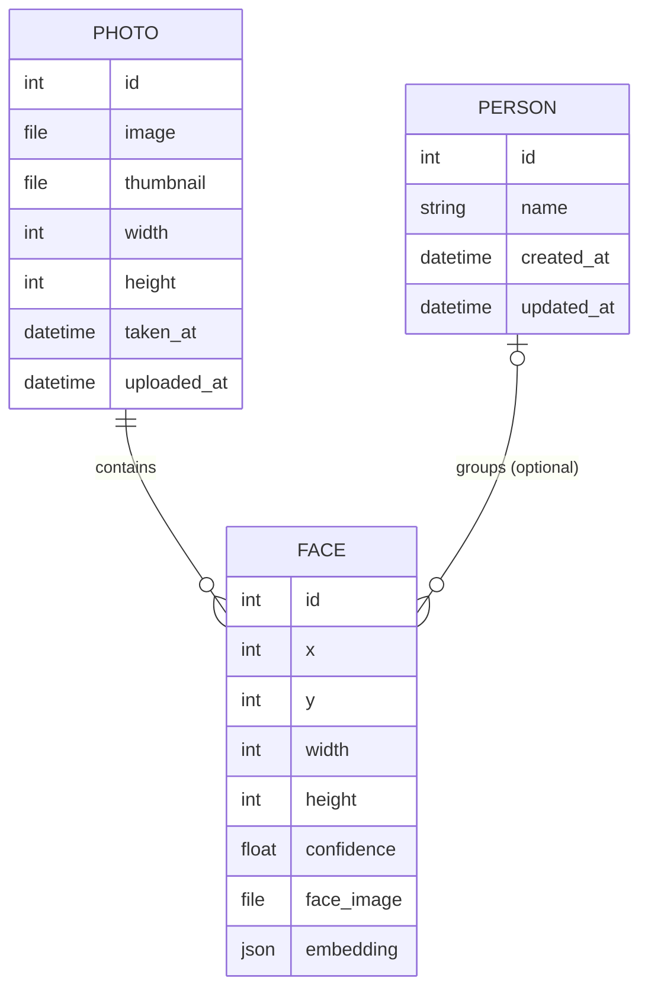
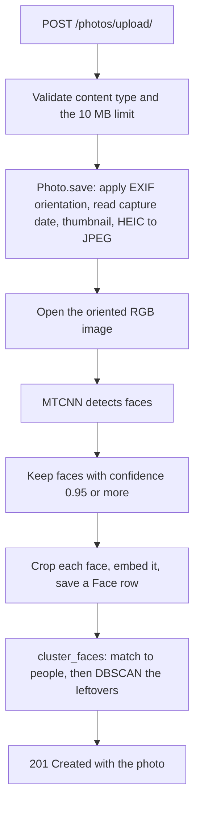

# FaceVault: project report

A study guide and technical report for the FaceVault project: what it is, how it works, what was measured, what went wrong along the way, and what it taught. It is written so that someone who did not build it can understand every part, and so that its author can explain every part.

**Contents**

1. [Summary](#1-summary)
2. [The problem](#2-the-problem)
3. [System design](#3-system-design)
4. [The machine-learning pipeline in depth](#4-the-machine-learning-pipeline-in-depth)
5. [Engineering lessons: what went wrong and how it was fixed](#5-engineering-lessons-what-went-wrong-and-how-it-was-fixed)
6. [Evaluation](#6-evaluation)
7. [Testing and quality](#7-testing-and-quality)
8. [Limitations and future work](#8-limitations-and-future-work)
9. [Privacy and ethics](#9-privacy-and-ethics)
10. [Study guide](#10-study-guide)
11. [Reproducing everything](#11-reproducing-everything)
12. [References](#12-references)

Reading paths: for ten minutes read sections 1 and 6.5; for the machine learning read 2, 4 and 6; for the software engineering read 3, 5 and 7.

---

## 1. Summary

**What was built.** FaceVault is a full-stack web application, a small self-hosted version of the "People" feature in Google Photos and Apple Photos. A user uploads photos; the backend finds every face, converts each face into a vector of 512 numbers (an *embedding*), and groups faces that belong to the same person. The user can name a person once and the name persists, because new faces are matched against the people already known before any regrouping happens.

**Stack.** React 19 and TypeScript (frontend); Django 5.2, Django REST Framework and PostgreSQL (backend); PyTorch with MTCNN (face detection), FaceNet (embeddings) and scikit-learn's DBSCAN (clustering).

**What was learned.** The first version worked on small examples. Measuring it on a public benchmark (LFW, 7,381 photos of 1,680 people) showed:

- the face embeddings were good (AUC 0.998, equal error rate 1.6%);
- the clustering threshold `eps` was badly chosen: with the original value 0.4, about **1 in 6 faces was filed under the wrong person**, and clustering all photos at once collapsed completely (ARI 0.007);
- a threshold chosen on held-out people (`eps = 0.2`) cut wrong-person errors to **0.07%** (about 1 in 1,400), at the price of leaving about 30% of faces unassigned;
- FaceNet's own input scaling gave a measurably better embedding than the scaling first used.

Both findings were adopted as the new defaults. The evaluation is also the most reusable part of the project: it runs the same functions as the application, so the numbers describe the real system.

**Numbers to remember** (held-out LFW people, 840 people, 3,663 faces, faces uploaded one at a time):

| | Before | Now |
|---|---|---|
| Faces filed under the wrong person | 16.7% | 0.07% |
| Pairwise precision | 0.611 | 0.997 |
| Faces placed in a person | 95.5% | 70.2% |
| Pairwise recall | 0.933 | 0.676 |

---

## 2. The problem

People look through thousands of photos. A useful feature is "show me all the photos of Anna", without anyone having labelled each photo. The system must work out, from pixels alone, which faces belong together.

This is harder than it first sounds, for three reasons:

1. **It is not classification.** In a classifier you know the possible labels in advance. Here the set of people is unknown and grows with every upload, so the task is *clustering*: discover the groups.
2. **Two kinds of mistake with different costs.** A *split* (one person ends up in two groups) is a nuisance. A *merge* (two people end up in one group, or a stranger appears in Anna's folder) is far worse for the user. A good system should prefer to leave a face unassigned over filing it wrongly.
3. **The system grows over time.** Photos arrive one by one. A name the user typed must not vanish because a later upload changed the grouping. This is the "stable identity" requirement and it drives the design in section 4.3.

The problem naturally breaks into three stages:

| Stage | Question | Method used |
|---|---|---|
| Detection | Where are the faces in this photo? | MTCNN |
| Representation | How do we turn a face into numbers so that "same person" means "close together"? | FaceNet embeddings |
| Grouping | Which faces belong to the same person, when the number of people is unknown? | Matching against known people, then DBSCAN |

---

## 3. System design

### 3.1 Architecture



The frontend only talks to the backend through one module (`frontend/src/services/api.ts`). The backend runs the machine-learning pipeline inside the upload request. That is simple and fine for one user, and it is also the main scalability limit (section 8).

### 3.2 Data model



- **Photo.** The stored image plus values derived at upload: `width` and `height` of the image *as displayed* (EXIF orientation applied), `taken_at` (the EXIF capture time, if any) and a 300-pixel JPEG thumbnail.
- **Face.** One detected face: its bounding box in the displayed image, the detector's confidence, a cropped image of the face and the 512-number `embedding` (stored as JSON). `person` is empty until the face is grouped.
- **Person.** Just an id and an optional name. A person is created automatically by clustering and is never deleted or recreated, which is what makes names stable.

### 3.3 What happens to one upload



Details worth knowing:

- Everything derived from the pixels (face boxes, `width`, `height`) is computed on the **EXIF-oriented** image. Browsers show a photo with its EXIF orientation applied, so for face boxes to line up with what the user sees, the backend must use the same orientation. This was a real bug in the first version (section 5).
- HEIC photos (the iPhone default) cannot be shown by most browsers. They are converted to JPEG on upload. JPEG, PNG and WebP originals are stored byte for byte.
- If clustering fails the upload still succeeds (the error is logged), because the photo and its faces are already saved.

### 3.4 The API

| Endpoint | Purpose |
|---|---|
| `POST /photos/upload/` | Upload one photo (multipart field `image`) |
| `GET /photos/` | Photos, 24 per page, newest capture date first (upload time if there is no EXIF date) |
| `GET /photos/<id>/` | One photo |
| `GET /faces/<photo_id>/` | Faces in one photo (boxes, confidence, person) |
| `GET /faces/people/` | All people with the number of faces |
| `GET /faces/people/<id>/` | One person with all their faces and the photos they are in |
| `PATCH /faces/people/<id>/` | Rename a person |

### 3.5 The frontend

Four routes: the Gallery (photos grouped by day, infinite scroll, upload box), People (a grid of circular cards), a Person page (editable name and the person's photos) and the full-screen Photo viewer (keyboard arrows, face boxes drawn over the photo). Server data is handled by TanStack Query. The face boxes are drawn in the pixel space the backend stores them in, scaled to the displayed size.

### 3.6 Design decisions and why

| Decision | Why | Cost |
|---|---|---|
| Match new faces to existing people before clustering | Names and identities stay stable across uploads | A wrong early assignment is never revisited |
| DBSCAN, not k-means | The number of people is unknown, and lone faces should stay unassigned (noise) | The threshold `eps` is sensitive (section 6) |
| Cosine distance on normalised embeddings | Direction, not length, carries identity | None significant |
| Synchronous processing in the request | Simplest thing that works for one user | About 1 to 3 seconds per photo on a CPU; a queue is the fix |
| Embeddings stored as JSON | No extra database extension needed | Comparison happens in Python, which will not scale to very large libraries |
| Capture time stored as "wall-clock labelled UTC" | A photo taken at 21:45 must stay on that calendar day for every viewer | Not a true instant; it is used only for sorting and grouping |
| Decision logic in a database-free module | The evaluation can run exactly the code the app runs | A small amount of extra structure |

---

## 4. The machine-learning pipeline in depth

### 4.1 Face detection: MTCNN

MTCNN (Multi-task Cascaded Convolutional Networks) is three small networks applied in sequence:

1. **P-Net** scans the image at several scales and proposes many candidate windows.
2. **R-Net** rejects most false candidates and refines the boxes.
3. **O-Net** makes the final decision and also outputs five facial landmarks.

Every stage also outputs a probability that the window contains a face. FaceVault keeps a detection only if that confidence is at least **0.95** (`MIN_FACE_CONFIDENCE`), which favours missing a face over inventing one. On LFW this gate still found a face in 7,379 of 7,381 images.

What FaceVault does *not* do: it uses only the bounding box, crops it tightly with no margin, and does not use the landmarks to align the face. The embedding model is usually fed aligned faces with a little margin, so this is a known simplification and a possible improvement.

### 4.2 Face embeddings: FaceNet

An *embedding* turns an image into a point in a high-dimensional space so that images of the same person land close together and different people land far apart. The FaceNet paper introduced this idea for faces. The model used here is an Inception-ResNet-v1 from the `facenet-pytorch` package, pretrained on VGGFace2 (about 3.3 million photos of 9,131 people), producing **512 numbers** per face. What matters for this project is the property of the resulting space, not the training recipe, and that property is what the evaluation measures.

**Normalisation and cosine distance.** The model's output has length 1 (it is L2-normalised). For two such vectors `a` and `b`, the cosine distance is `1 - a·b`, which equals half the squared Euclidean distance between them. "Distance 0" means identical direction; larger means less alike. Everything downstream, including the threshold `eps`, is a cosine distance.

**Input scaling.** A neural network expects its input on the scale it was trained with. FaceNet's own pipeline scales pixel values to roughly [-1, 1] with `(pixel - 127.5) / 128`. The first version of FaceVault scaled to [0, 1] with `pixel / 255`. The model still produced useful embeddings, which is why the problem was invisible until measured. On LFW the correct scaling was better on every verification measure:

| Input scaling | AUC | Equal error rate | Same-person pairs found at 0.1% false matches |
|---|---|---|---|
| `pixel / 255` (first version) | 0.9979 | 1.63% | 90.6% |
| `(pixel - 127.5) / 128` (now) | 0.9987 | 1.14% | 94.3% |

Changing the scaling makes every stored embedding stale (old and new live on different scales), so the repository includes `python manage.py reembed_faces`, which recomputes them from the saved face crops.

### 4.3 Grouping faces: matching, then DBSCAN

**DBSCAN in one paragraph.** DBSCAN (density-based clustering) has two parameters. `eps` is a distance. `min_samples` is a count. A point is a *core point* if at least `min_samples` points (itself included) lie within `eps` of it. Clusters grow by linking core points that are within `eps` of each other, and points that are near a core point but not core themselves join as *border points*. Points that belong to no cluster are *noise*. Unlike k-means, it needs no number of clusters, and it leaves outliers unassigned, both of which suit this problem.

**A fact that explains most of the results.** With `min_samples = 2` a point is core as soon as it has one neighbour within `eps`, so there are no border points, and the clusters are exactly the **connected components** of the graph that links every pair of faces closer than `eps`. This is single-linkage clustering. A single wrong link between two people's groups merges them completely, and wrong links chain together.

**The incremental scheme.** After every upload, `cluster_faces()` looks at the faces that have no person yet:

1. **Match.** Compute the *centroid* (the normalised average embedding) of each existing person. A new face whose cosine similarity to the nearest centroid is at least `1 - eps` joins that person.
2. **Cluster.** The remaining faces are clustered among themselves with DBSCAN. A group of at least `min_samples` faces becomes a new person.
3. **Wait.** A face that is still alone stays unassigned and is considered again after the next upload.

People, once created, keep all their faces and their name. Only new faces are ever decided. This is the "stable identity" behaviour, and it also has a cost: if an early face is attached to the wrong person, it stays there, and centroids are not recomputed to correct drift.

**A tiny example.** Suppose Anna has three photos, so her centroid sits in the middle of her three embeddings. A fourth photo of Anna arrives. Its embedding is within `eps` of her centroid, so it joins her: no clustering is needed. Another photo shows Ben, whom the system has never seen. It is not close to Anna's centroid, so it goes to the leftover pool. Alone, it is noise, so it stays unassigned. When a second photo of Ben arrives, the two photos are within `eps` of each other and form a cluster of size 2, so Ben becomes a new person.

### 4.4 Why `eps` is the whole game

`eps` is a decision threshold: "closer than this means the same person". Like any threshold it trades two kinds of error, and the evaluation makes the trade visible.


Between `eps` 0.2 and 0.4 the share of same-person pairs accepted rises about 2.3 times (39% to 91%), while the share of different-person pairs accepted rises about 240 times (54 wrong pairs to about 12,800, out of 27.2 million). Wrong pairs are what cause merges.

**A rough way to see the cliff.** Treat each real person as a node and each wrong link as an edge between two people. Random graphs have a sharp transition: once the average number of edges per node passes about one, a single giant connected component appears. In the held-out half there are 840 people, so the transition needs roughly 420 wrong links. The measured wrong pairs over all 7,379 faces (4,435 at `eps` 0.35, 1,222 at 0.30, 54 at 0.20) shrink to about a quarter in a half-sized set, because pairs scale with the square of the number of faces: roughly 1,100 at 0.35, 300 at 0.30 and 14 at 0.20. That puts the transition between 0.30 and 0.35, which is where the measured quality collapses (ARI 0.75 at 0.30, 0.42 at 0.325, 0.10 at 0.35), and puts 0.20 far below it. This is back-of-the-envelope reasoning, not a measured result: real wrong links are not random (they concentrate on look-alike people) and several can join the same pair of people, so it only shows why the drop is sudden. It also predicts that the safe `eps` falls as the library grows, because the number of wrong pairs grows with the square of the number of faces.

---

## 5. Engineering lessons: what went wrong and how it was fixed

A review and testing of the first version found the following problems. Each was reproduced before it was fixed.

| Symptom | Cause | Fix | How it was checked |
|---|---|---|---|
| Portrait phone photos mostly got no faces, and the ones found never matched | Phones store portrait shots sideways plus an EXIF orientation tag. The code ignored the tag, so faces were sideways | Detection and cropping run on an EXIF-oriented image | Sideways test images: faces found in 4 of 24 before, 24 of 24 after. Even for those 4, the similarity to the upright crop of the same face was only about 0.07 |
| `width` and `height` always empty in the database | They were set in memory but the later `save(update_fields=['thumbnail'])` did not include them | All derived values are computed once, before the first save | Test that reads the row back |
| Uploading a PNG with transparency returned an error and left a photo with no faces | The face crop kept the transparency channel and JPEG cannot store it | The oriented image is converted to RGB first | Test with an RGBA PNG |
| HEIC photos showed as broken images | Thumbnails of HEIC uploads were HEIC files, which most browsers cannot show. The frontend worked around it by downloading and converting each one in the browser with a 1.35 MB library | The server converts HEIC to JPEG on upload; the browser library was removed | Test that the stored file is a JPEG |
| The photo viewer failed for photos beyond roughly the 200th | It found a photo by scanning every page of the list, giving up after 100 pages, and the page size was a leftover 2 | A `GET /photos/<id>/` endpoint and a page size of 24 | Endpoint tests |
| Photos were grouped by upload day, so a bulk import of old photos all appeared as "Today" | Grouping used the upload time | The EXIF capture time is stored and used, with the day read in UTC so it does not shift with the viewer's time zone | Browser check in a UTC+13 time zone: a 21:45 photo stayed on its own day |
| The documented Python version was wrong | The setup text said "Python 3.10+", but `torch==2.2.2` has no wheels for 3.13 and a pinned package needs 3.11 | Documented as 3.11 to 3.12 and checked with the dependency resolver | Resolver output for 3.10 to 3.13 |
| The long benchmark run died on Windows | The result cache was replaced while another handle held it open, which Windows refuses, and a transient lock from another program could do the same | The file is closed after reading, the replace is retried, and a failed checkpoint only warns | Tests that simulate a locked file, a retried replace and a failed checkpoint |
| A healthy benchmark run looked dead | Output redirected to a file is buffered, and the analysis stage printed nothing for ten minutes | Line-buffered output and a message for every stage | Run with output redirected |

Two general lessons:

- **Measure before trusting.** Two of the largest problems (the sideways faces and the `eps` default) did not show up on a handful of examples. They showed up only when the system was run on many inputs and scored against the truth.
- **A different machine finds different bugs.** The file-locking failure was invisible on Linux and appeared on the first Windows run.

---

## 6. Evaluation

### 6.1 Questions

1. Do the embeddings separate same-person pairs from different-person pairs? (*verification*)
2. If every photo were clustered at once, how good is DBSCAN, and which `eps` is best? (*batch clustering*)
3. The app clusters after every upload and never revisits a decision. How much does that cost, and does the upload order matter? (*incremental clustering*)

### 6.2 Data: LFW

*Labeled Faces in the Wild* has 13,233 photos of 5,749 people, collected from news articles. FaceVault used the original (unaligned) images of the 1,680 people who have at least two photos, capped at 20 photos per person because a few people have hundreds (one has 530) and would dominate the scores. That gives **7,381 photos**; MTCNN with the 0.95 gate found a face in **7,379**. Each LFW photo is centred on the labelled person, so the face nearest the image centre was used.

### 6.3 Method

- **The same code as the app.** The benchmark calls `detect_faces`, `generate_embedding` and `plan_assignments`, the very functions the application uses. A test checks that replaying uploads through the benchmark gives the same people as the real database-backed `cluster_faces()`.
- **No tuning on the test set.** The 1,680 people are split at random into two disjoint halves of 840. `eps` is chosen on the *tune* half and every clustering number is reported on the other half, the *held-out* half. If the same people were used for both, the chosen `eps` would look better than it is.
- **Incremental replay.** Faces arrive one at a time in a random order, and after each one the app's matching-and-clustering logic runs. The result is averaged over 5 random orders (the standard deviation is at most 0.02 ARI).

**Metrics.**

| Metric | Meaning |
|---|---|
| ARI (adjusted Rand index) | Agreement between the grouping and the truth. 1 is perfect, about 0 is chance |
| Pairwise precision | Of the pairs of faces put together, the share that really are the same person |
| Pairwise recall | Of the real same-person pairs, the share that were put together |
| Faces placed in a person | The share of faces that are in some person (the rest are unassigned) |
| Wrong person | Of the faces filed under a person, the share that are not that person's most common true identity |
| AUC, equal error rate | Threshold-free quality of the embeddings: how well distance separates same from different |

### 6.4 Results

**Verification** (all pairs of the 7,379 faces: 27,724 same-person pairs and 27,193,407 different-person pairs):

| Input scaling | AUC | Equal error rate | Same-person pairs found at 0.1% false matches |
|---|---|---|---|
| `pixel / 255` | 0.9979 | 1.63% | 90.6% |
| `(pixel - 127.5) / 128` | 0.9987 | 1.14% | 94.3% |

**Batch clustering on the held-out people** (DBSCAN over all faces at once, `min_samples = 2`):

| eps | ARI, `pixel / 255` | ARI, FaceNet scaling | Precision, FaceNet | Recall, FaceNet |
|---|---|---|---|---|
| 0.100 | 0.188 | 0.211 | 1.000 | 0.118 |
| 0.125 | 0.331 | 0.375 | 1.000 | 0.231 |
| 0.150 | 0.482 | 0.563 | 1.000 | 0.393 |
| 0.175 | 0.652 | 0.716 | 1.000 | 0.558 |
| **0.200** | 0.770 | 0.792 | 0.940 | 0.684 |
| 0.225 | 0.814 | 0.852 | 0.943 | 0.778 |
| 0.250 | 0.812 | 0.861 | 0.865 | 0.857 |
| 0.275 | 0.760 | 0.853 | 0.807 | 0.906 |
| 0.300 | 0.537 | 0.746 | 0.626 | 0.927 |
| 0.325 | 0.112 | 0.418 | 0.269 | 0.950 |
| 0.350 | 0.045 | 0.098 | 0.053 | 0.965 |
| 0.375 | 0.016 | 0.032 | 0.018 | 0.977 |
| 0.400 | 0.007 | 0.014 | 0.009 | 0.983 |


**Incremental clustering on the held-out people** (the app's real mode; mean of 5 orders):

| Input scaling | eps | ARI | Precision | Recall | Faces placed | Wrong person | People found (840 real) |
|---|---|---|---|---|---|---|---|
| `pixel / 255` (before) | 0.4 | 0.737 | 0.611 | 0.933 | 95.5% | 16.73% | 607 |
| `pixel / 255` | 0.225 | 0.826 | 0.996 | 0.706 | 74.7% | 0.12% | 647 |
| `pixel / 255` | 0.15 | 0.514 | 1.000 | 0.346 | 43.4% | 0.00% | 417 |
| FaceNet scaling | 0.4 | 0.790 | 0.671 | 0.961 | 96.4% | 13.12% | 651 |
| **FaceNet scaling (now)** | **0.2** | **0.805** | **0.997** | **0.676** | **70.2%** | **0.07%** | **603** |
| FaceNet scaling | 0.15 | 0.582 | 1.000 | 0.411 | 47.4% | 0.00% | 426 |

The `eps` for each scaling was the one that scored best on the tune half (0.225 for the original scaling, 0.2 for FaceNet scaling) and 0.15 is the setting with the highest recall that kept pairwise precision at 0.99 or better there.


**Batch against incremental** (FaceNet scaling, held-out people):

| eps | ARI, all at once | ARI, one at a time |
|---|---|---|
| 0.4 | 0.014 | 0.790 |
| 0.2 | 0.792 | 0.805 |

### 6.5 Analysis and conclusions

1. **The embeddings are strong.** An AUC of 0.999 means a random same-person pair is almost always closer than a random different-person pair. The weak link was never the embedding.
2. **`eps = 0.4` was a bad default.** All at once, clustering collapsed (ARI 0.014 and 0.007): most faces ended in a few huge groups. Even incrementally, about one face in six (13% to 17%) was filed under the wrong person.
3. **The incremental design rescues a bad threshold but does not fix it.** Matching to existing people means one stray link cannot merge two established groups, which is why one-at-a-time ARI is 0.790 against 0.014 all at once at `eps` 0.4. At a good `eps` the two modes are nearly equal (0.805 and 0.792), so the design's real value is stability of names, not accuracy.
4. **There is a cliff, and `eps` 0.2 stays on the safe side of it.** Quality peaks around 0.2 to 0.25 and falls sharply after 0.3 (section 4.4). Choosing 0.2 trades a little recall for a margin of safety, and the safe value should shrink as libraries grow.
5. **Precision first costs recall.** At `eps` 0.2, 0.07% of filed faces are wrong, but only 70% of faces are placed in a person; the rest wait for more photos of that person. For a photo app, a missing photo is better than a stranger in someone's folder, but it is a real cost.
6. **FaceNet's input scaling is better, on the whole curve.** At every one of the 13 `eps` values on the held-out half the correct scaling had the higher ARI, and its precision-recall curve lies above the other at high recall. One subtlety: comparing each scaling at its *own* tuned `eps` made the original look slightly better (0.826 against 0.805). That is selection noise: the tune half picked 0.2 for FaceNet scaling while the held-out half peaks at 0.25, which shows how steep the curve is near the cliff.
7. **Growth.** At the old setting (`pixel / 255`, `eps` 0.4), the share of faces placed in a person rose from 47% with 367 faces uploaded to 95% with all 3,663, while pairwise precision stayed between 0.60 and 0.63 throughout. Faces wait for a second photo of the same person before they can form a group.

### 6.6 Threats to validity

- **Easy data.** LFW is mostly frontal, well-lit celebrity photos. A family library (children, side views, glasses, bad light, strangers in the background) will be harder. Scores here are best read as an upper bound.
- **Not the standard protocol.** The standard LFW benchmark scores 6,000 prepared pairs. This evaluation scores all pairs and the clustering, so its numbers must not be compared with published LFW accuracies.
- **One split.** The two halves disagreed about the best `eps` for the new scaling (0.2 and 0.25). Cross-validation over several splits would give a spread instead of a single number.
- **Library size.** The best `eps` depends on how many faces there are. The held-out half has 3,663 faces; a larger or much smaller library will behave differently. A quick check on 24 photos left 9 of them unassigned at `eps` 0.2.
- **Mild selection.** The choice of input scaling drew on the sweep of both halves and on the verification scores of all faces, so the "now" numbers are slightly less clean than the `eps` choice alone.
- **Capped identities.** At most 20 photos per person, so pairwise scores are not dominated by a handful of famous people.

---

## 7. Testing and quality

**68 backend tests** (all run with an in-memory SQLite database, mocked ML calls where needed, and no network access):

| Area | Tests | What they cover |
|---|---|---|
| Photo ingest and endpoints (`photos`) | 16 | EXIF orientation, saved dimensions, HEIC to JPEG, capture date, derived fields are read-only, detail endpoint, paging, ordering |
| People and re-embedding (`faces`) | 4 | Dates in the person endpoint; re-embedding keeps people, skips faces without a crop, clears unreadable ones |
| Matching and clustering (`ml`) | 12 | The matching and clustering rules, stable names across uploads, the embedding input scaling, and that the benchmark replay equals the real `cluster_faces()` |
| Benchmark (`evaluation`) | 36 | Metrics checked against brute force and scikit-learn, the simulation, the dataset loader, the cache and the report |

How the tests were checked:

- The first photo tests were run against the *original* code: 14 of the 17 failed, confirming they detect the bugs they target.
- Key tests were checked by deliberately breaking the code they cover (for example reverting the input scaling or removing a retry) and confirming the test fails.
- When the clustering logic was moved into a database-free module, the old and new versions were run side by side on 36 synthetic scenarios (3 datasets, 3 upload batch sizes, 4 parameter settings; 623 people created, 1,074 matches to existing people) and gave identical results.
- On 24 real photos with the real models, the upload path, clustering and the re-embedding command were exercised end to end, and the evaluation script reproduced the app's grouping exactly.

**Continuous integration** (GitHub Actions): the backend job installs the pinned requirements, runs Django's system check, confirms the models and migrations are in sync and runs the test suite. The frontend job runs `npm ci`, the TypeScript check, ESLint and the production build.

**Not covered:** the frontend has no unit tests, and PostgreSQL is exercised locally but not in CI.

---

## 8. Limitations and future work

Roughly in order of value:

1. **Test a separate threshold for matching.** Faces are matched to existing people with the same `eps` that DBSCAN uses to form new groups, but these are different jobs. Matching to a centroid cannot chain, so it can safely use a looser threshold, which may recover recall without bringing back merges. The benchmark code already supports a separate value; it has not been swept.
2. **Let `eps` adapt to library size**, since the safe value falls as the library grows.
3. **Merge, split and delete in the UI**, so a wrong early grouping can be corrected. Today it is never revisited.
4. **Face quality filters** (minimum size, blur) and an aligned, margin-padded crop, which is what the embedding model was trained on.
5. **Evaluate on harder data and with cross-validation**, and report a spread.
6. **Background processing** (a job queue) instead of doing the work inside the upload request.
7. **A vector index** (for example `pgvector`) instead of comparing JSON embeddings in Python.
8. **Authentication and per-user libraries.** None exist now.
9. **Frontend tests.**

---

## 9. Privacy and ethics

Face embeddings are **biometric data**: a compact numeric fingerprint of a person. Under the EU's GDPR, biometric data used to identify someone is a special category of personal data, so a service that grouped other people's faces would need a legal basis and strong safeguards. A purely personal, household use of one's own library is generally outside the regulation's scope, but that is a narrow exemption (and this is not legal advice).

Practical consequences for this project:

- There is no authentication, so the server must not be exposed to the internet as it is.
- Everything runs locally; no photo or embedding leaves the machine.
- Photos used for the screenshots and demos should be ones the author owns or has permission to show.
- Face recognition can be wrong in ways that are not evenly spread across groups of people, and the benchmark used here (mostly celebrity photos) does not measure that. A real deployment would need a fairness evaluation first.

---

## 10. Study guide

### 10.1 Glossary

| Term | Meaning |
|---|---|
| Embedding | A vector of numbers representing an image so that similar images are close. Here 512 numbers per face |
| L2 norm, normalisation | The length of a vector; normalising scales it to length 1 |
| Cosine similarity / distance | `a·b` for unit vectors / `1 - a·b`. Measures the angle between vectors |
| Centroid | The normalised average of a person's embeddings; the "average face" |
| DBSCAN | Density-based clustering with parameters `eps` and `min_samples` |
| Core, border, noise point | Dense point / point next to a dense one / point in no cluster |
| `eps` | The distance below which two faces count as neighbours |
| Connected component | A set of nodes linked, directly or through others, by edges |
| Chaining | Clusters merging through a chain of links; the failure mode of single-linkage clustering |
| Giant component | The single huge cluster that appears when random links pass a threshold |
| ROC, AUC | Curve of true against false positive rate over all thresholds / the area under it |
| Equal error rate | The error rate at the threshold where false accepts and false rejects are equal |
| ARI | Adjusted Rand index, agreement between two groupings corrected for chance |
| Precision, recall | Share of what was claimed that is right / share of what is right that was claimed |
| Identity-disjoint split | Splitting by person, so no person appears in both halves |
| EXIF orientation | A tag saying how a photo must be rotated to be shown upright |
| Verification vs identification | "Are these two faces the same person?" against "who is this?" |

### 10.2 Questions and model answers

**1. Why clustering and not classification?** The set of people is unknown and grows. A classifier needs fixed labels; clustering discovers groups.

**2. Why DBSCAN and not k-means?** k-means needs the number of clusters in advance and assigns every point somewhere. Here the number of people is unknown and a lone face should stay unassigned, which DBSCAN's noise label provides.

**3. Why cosine distance?** The embeddings have length 1, so only direction carries information. For unit vectors, cosine distance is half the squared Euclidean distance, so the two give the same ranking.

**4. Why match new faces to existing people before clustering?** So a person's identity, and the name a user gave them, stay stable. Without it, every upload would recompute the groups from scratch.

**5. What is the downside of that?** Early mistakes are permanent, because assigned faces are never revisited, and centroids are not recomputed to correct drift. That is why precision at the start matters.

**6. Why did `eps = 0.4` fail?** At that distance about 0.05% of different-person pairs are accepted. Among millions of pairs that is thousands of wrong links, and DBSCAN with `min_samples = 2` merges everything connected by links (single-linkage). A few wrong links between established groups merge them.

**7. How do you explain the cliff?** Treat people as nodes and wrong links as edges. Random graphs have a sharp transition near one edge per node, where a giant component appears. The number of wrong links grows exponentially with `eps`, so it crosses that point suddenly.

**8. Why is recall only about 0.68 and is that acceptable?** At a strict `eps`, a face only joins a group if a close enough partner exists, and many people have just two photos in the data. For a photo app, precision matters more: a stranger in someone's folder is worse than a missing photo. It is a trade-off to state openly, and the planned looser matching threshold targets exactly this.

**9. Why split the people into tune and held-out halves?** If `eps` is chosen on the same people it is scored on, the score is optimistic. Splitting by *person* (not by photo) also stops the same person appearing in both halves.

**10. How do you know the evaluation measures the real app?** It calls the same functions, and a test replays uploads through the benchmark and through the real database-backed `cluster_faces()` and requires the same people.

**11. What was the hardest bug?** Portrait phone photos. Phones store them sideways with an EXIF orientation tag; the first version ignored it, so faces were sideways, rarely detected, and when detected never matched. The fix was to apply the orientation before any pixel work, so the boxes also line up with what browsers display.

**12. Why store the capture time as "wall clock labelled UTC"?** EXIF stores local camera time with no time zone. Treating it as UTC and reading the day in UTC keeps a 21:45 photo on its own calendar day for every viewer, wherever they are.

**13. How would you scale this to a million photos?** A job queue for the pipeline, a vector index instead of comparing JSON in Python, an approximate nearest-neighbour search for matching, and a smaller `eps` or a different clustering method for large libraries because chaining gets worse with size.

**14. What would you improve first?** Test a separate looser threshold for matching new faces to existing people, then let `eps` depend on library size, then add merge and split in the interface.

**15. What are the limits of this evaluation?** Easy data (LFW), a single split, results depend on library size, and it is not the standard LFW protocol, so the numbers do not compare with published accuracies.

### 10.3 Exercises

1. Run the benchmark with `--max-identities 100` and a different `--seed`. How much do the numbers move?
2. In `backend/.env`, set `FACE_CLUSTER_EPS=0.4`, upload 30 photos of 3 people, and compare with 0.2. Which faces end up unassigned, and which in the wrong person?
3. Plot the same sweep for `min_samples = 3`. Why does it place fewer faces in a person?
4. Read `plan_assignments` in `backend/ml/clustering.py` and add a looser threshold for step 1 (it already accepts `match_eps`). Sweep it in the benchmark.
5. Draw the face boxes on a photo that is stored sideways with and without applying the EXIF orientation. What goes wrong?

---

## 11. Reproducing everything

```bash
# application
cd backend && python -m venv .venv && source .venv/bin/activate    # Windows: .venv\Scripts\activate
pip install -r requirements.txt && cp .env.example .env
python manage.py migrate && python manage.py runserver
cd ../frontend && npm install && npm run dev

# tests
cd backend && DB_ENGINE=django.db.backends.sqlite3 DB_NAME=db.sqlite3 python manage.py test
cd ../frontend && npm run typecheck && npm run lint && npm run build

# evaluation (needs about 7,400 images from LFW; see backend/evaluation/README.md)
cd backend && pip install -r requirements-eval.txt
python -m evaluation.evaluate_lfw --lfw-dir /path/to/lfw --ablate-preprocessing --eps 0.10:0.40:0.025 --min-samples 2,3

# redraw the figures from the committed results
python docs/make_figures.py
```

Where things are: `backend/ml/` (detection, embeddings, clustering), `backend/photos/` (ingest and upload), `backend/faces/` (people API and the re-embedding command), `backend/evaluation/` (benchmark and committed results), `frontend/src/` (the app), `docs/` (this report, figures, screenshots).

---

## 12. References

- Huang, G. B., Ramesh, M., Berg, T., Learned-Miller, E. *Labeled Faces in the Wild: A Database for Studying Face Recognition in Unconstrained Environments.* University of Massachusetts Amherst, Technical Report 07-49, 2007.
- Schroff, F., Kalenichenko, D., Philbin, J. *FaceNet: A Unified Embedding for Face Recognition and Clustering.* CVPR 2015.
- Cao, Q., Shen, L., Xie, W., Parkhi, O. M., Zisserman, A. *VGGFace2: A Dataset for Recognising Faces across Pose and Age.* 2018.
- Zhang, K., Zhang, Z., Li, Z., Qiao, Y. *Joint Face Detection and Alignment using Multi-task Cascaded Convolutional Networks.* IEEE Signal Processing Letters, 2016.
- Ester, M., Kriegel, H.-P., Sander, J., Xu, X. *A Density-Based Algorithm for Discovering Clusters in Large Spatial Databases with Noise.* KDD 1996.
- Hubert, L., Arabie, P. *Comparing Partitions.* Journal of Classification, 1985 (the adjusted Rand index).
- Erdős, P., Rényi, A. *On the evolution of random graphs.* 1960 (the giant-component transition used for intuition in section 4.4).
